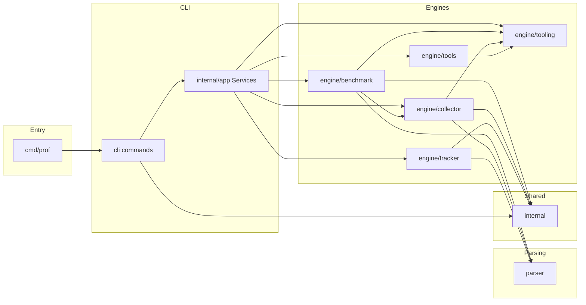

# Prof codebase design

This document maps the Prof repository: entrypoints, packages, data flow through `cli` into `engine/*`, on-disk layout under `bench/`, configuration types, and conventions for tests and errors. It is for contributors changing the code, not for learning what Prof does from a user perspective.

## Responsibilities by area

- [`engine/benchmark`](engine/benchmark): `go test` orchestration, profile collection pipeline, layout under `bench/<tag>/`.
- [`engine/collector`](engine/collector): pprof text, PNG, grouped text, manual file ingest, per-function list output (via shared runner and argv helpers).
- [`engine/tracker`](engine/tracker): load two profiles, diff, report formats, apply `ci_config` rules.
- [`engine/tooling`](engine/tooling): subprocess [`Runner`](engine/tooling/runner.go), profile [`Catalog`](engine/tooling/catalog.go), `go tool pprof` argv construction.
- [`parser`](parser): decode profile binaries into structured data; pipeline stages for comparisons.
- [`internal`](internal): JSON config types, path constants, `BenchArgs` / collection wiring, template IO ([`internal/api.go`](internal/api.go)).
- [`cli`](cli) and [`internal/tui`](internal/tui): Cobra commands, flags, Bubble Tea and Survey UIs; call [`internal/app`](internal/app) services.

## Architecture



Composition root: [`internal/app/services.go`](internal/app/services.go) defines narrow interfaces (`Benchmark`, `Collector`, `Tracker`, `Tools`, `Setup`) plus a shared [`tooling.Runner`](engine/tooling/runner.go) for subprocess execution. Defaults wire into `engine/*` in [`internal/app/defaults.go`](internal/app/defaults.go). Prefer adding behavior behind these interfaces when the CLI surface stays stable.

The installable binary is `go install …/cmd/prof@latest`; that `main` package calls [`cli.Execute`](cli/api.go) (module path in [`go.mod`](go.mod)).

### Package layout (actual directories)

| Path | Role |
|------|------|
| `cmd/prof` | `main`; delegates to [`cli.Execute`](cli/api.go) |
| [`cli`](cli) | Cobra commands, flags, TUI glue; calls `app.Services` |
| [`internal/app`](internal/app) | Composition root interfaces and default adapters; holds [`tooling.Runner`](engine/tooling/runner.go) |
| [`engine/tooling`](engine/tooling) | Subprocess [`Runner`](engine/tooling/runner.go), profile [`Catalog`](engine/tooling/catalog.go), `go tool pprof` argv helpers; in-process parsing stays in [`parser`](parser) |
| [`engine/benchmark`](engine/benchmark) | Layout, `go test -bench`, run pipeline, delegates artifact helpers to collector |
| [`engine/collector`](engine/collector) | pprof text, PNG, function list IO (via runner and tooling argv), manual ingest, package-grouped text |
| [`engine/tracker`](engine/tracker) | Load two profiles, diff, reports, CI filter application |
| [`engine/tools/benchstats`](engine/tools/benchstats), [`engine/tools/qcachegrind`](engine/tools/qcachegrind) | Optional tools on collected data |
| [`parser`](parser) | Binary pprof to [`ProfileData`](parser/types.go) and line objects; `Pipeline` for swappable stages |
| [`internal`](internal) | Shared JSON config types ([`internal/types.go`](internal/types.go)), wire args (`BenchArgs`, `CollectionArgs`), path constants ([`internal/const.go`](internal/const.go)), config and template helpers ([`internal/api.go`](internal/api.go)) |
| [`internal/repofs`](internal/repofs) | Module root lookup (`go.mod`) and tag directory clean or create, used by collectors and benchmarks |
| [`internal/testpaths`](internal/testpaths) | Test-only helpers to resolve paths under `tests/assets` |

Shared types live in `internal` as files (no separate `internal/config` package).

## Contributor map (where to start)

| Command | First files | Flow |
|---------|-------------|------|
| `prof auto` | [`cli/cmd_collect.go`](cli/cmd_collect.go) to [`engine/benchmark/entry.go`](engine/benchmark/entry.go) | Validate flags, load optional `config_template.json`, layout, `runBenchAndGetProfiles` |
| `prof manual` | [`cli/cmd_collect.go`](cli/cmd_collect.go) to [`engine/collector/manual_process.go`](engine/collector/manual_process.go) | Tag dir, per-file profile processing and function lists |
| `prof track auto` / `manual` | [`cli/cmd_track.go`](cli/cmd_track.go) to [`engine/tracker/run.go`](engine/tracker/run.go) | Build [`Selections`](engine/tracker/types.go), compare, format output, CI apply |
| `prof ui` | [`cli/cmd_ui.go`](cli/cmd_ui.go), [`internal/tui/hub.go`](internal/tui/hub.go) | Bubble Tea menu, Survey prompts, engines |
| `prof tui` | [`cli/cmd_tui.go`](cli/cmd_tui.go), [`cli/tui.go`](cli/tui.go) | Survey-driven flow, same engines as `prof auto` / track |
| `prof setup` | [`cli/cmd_setup.go`](cli/cmd_setup.go) to [`internal/api.go`](internal/api.go) `CreateTemplate` | Writes template JSON beside `go.mod` |
| `prof tools …` | [`cli/cmd_tools.go`](cli/cmd_tools.go) to `engine/tools/*` | Benchstat and qcachegrind helpers |

[`cli/discovery.go`](cli/discovery.go) lists tags and benchmarks from existing `bench/` output for TUI and track prompts; known profile names come from [`tooling.DefaultCatalog`](engine/tooling/catalog.go). Benchmark name discovery (`BenchmarkXxx` in `_test.go` files) lives in [`engine/benchmark/discovery.go`](engine/benchmark/discovery.go).

## Profile pipelines

### Automated benchmark (`prof auto`)

1. [`benchmark.RunBenchmarks`](engine/benchmark/entry.go) loads config via [`internal.LoadFromFile`](internal/api.go) (`config_template.json` at module root). Missing file yields empty config; see logging in `entry.go`.
2. Prepares directories under `bench/<tag>/` ([`layout.go`](engine/benchmark/layout.go)).
3. For each benchmark: run `go test` in the package directory that defines the benchmark ([`gotest.go`](engine/benchmark/gotest.go)), move profile binaries into `bench/<tag>/bin/<bench>/`.
4. [`processProfiles`](engine/benchmark/profiles.go) runs in order: text listing, optional package-grouped text, then PNG (Graphviz `dot`). Each step uses the shared [`tooling.Runner`](engine/tooling/runner.go). Then [`collectProfileFunctions`](engine/benchmark/pipeline.go) uses [`parser`](parser) and collector for per-function `pprof -list` style output.

### Manual ingest (`prof manual`)

[`collector.RunCollector`](engine/collector/manual_process.go): cleans or creates tag dir, loads the same JSON config, infers benchmark stem from filenames, emits text, grouped, and function outputs. Does not run `go test`.

## Output layout

```
bench/
└── <tag>/
    ├── description.txt
    ├── bin/<BenchmarkName>/<BenchmarkName>_<profile>.out
    ├── text/<BenchmarkName>/<BenchmarkName>_<profile>.txt
    ├── <profile>_functions/<BenchmarkName>/<function>.txt (and optional .png under that tree when generated)
```

Exact names are centralized in [`internal/const.go`](internal/const.go) and path helpers in `engine/benchmark` and `engine/collector`.

## Configuration (`config_template.json`)

JSON shape is defined by [`internal.Config`](internal/types.go):

- `function_collection_filter`: per-benchmark or global filter map; global key is [`internal.GlobalSign`](internal/const.go) (`"*"`). Each entry is a [`FunctionFilter`](internal/types.go) with `include_prefixes` and `ignore_functions` (short names after the last `.`).
- `ci_config`: optional thresholds and ignore lists for `prof track` ([`engine/tracker/ci_apply.go`](engine/tracker/ci_apply.go)).

Template creation is implemented from [`cli/cmd_setup.go`](cli/cmd_setup.go) through [`internal/api.go`](internal/api.go). Machine-readable CI schema and examples for operators live in [docs/cicd_configuration.md](docs/cicd_configuration.md).

## Known sharp edges

- Grouped reports (`--group-by-package`): [`prof auto`](engine/benchmark/profiles.go) passes an empty filter into grouped package generation; [`prof manual`](engine/collector/manual_process.go) uses the resolved filter from config. Outputs can differ between flows; intentional changes need tests and a changelog note.
- Optional config: absent `config_template.json` is allowed; collection uses unfiltered defaults where applicable.
- PNG: requires Graphviz `dot` on `PATH`. The CLI exposes `--skip-png` to treat PNG failure as non-fatal; default is strict.
- Profiles on disk: in strict mode (default), missing expected `.out` files after a bench run fail the command; `--lenient-profiles` continues with a warning when binaries are missing.

## Error handling (project rules)

- Return `error` from operations that fail; wrap with `fmt.Errorf("…: %w", err)` so callers can use `errors.Is` and `errors.As`.
- Do not downgrade real failures to `slog.Info`; optional behavior must be flag-driven (see `--skip-png`, `--lenient-profiles`) or documented as explicitly best-effort.
- The `prof track` HTML and JSON formatters propagate write failures to the CLI (non-zero exit).

## Dependencies (high level)

- `spf13/cobra`: CLI structure
- `charmbracelet/bubbletea` (via `cli` / `internal/tui`): `prof ui` full-screen menu
- `AlecAivazis/survey/v2`: prompts for `prof tui` and parts of `prof ui`
- `github.com/google/pprof` (via [`parser`](parser)); external `go tool pprof` invocations are argv-built in [`engine/tooling`](engine/tooling) and executed through [`tooling.Runner`](engine/tooling/runner.go)

## Testing

- `go test ./...`: unit tests under `cli`, `engine/*`, `parser`, `internal`, plus [`tests/blackbox_test.go`](tests/blackbox_test.go) for coarse integration checks.
- Lint: `forbidigo` in [`.golangci.yml`](.golangci.yml) blocks `exec.Command` / `exec.CommandContext` outside [`engine/tooling/exec_runner.go`](engine/tooling/exec_runner.go), [`engine/tooling/exec_spawn.go`](engine/tooling/exec_spawn.go), and the `tests/` package so subprocess policy stays enforceable.
- Fixture-style environments sometimes live under `tests/` directories with spaces in names. Run tests from repo root.

## Design principles

1. Engines own orchestration; `cli` stays thin.
2. `parser` stays toolkit-oriented (`Pipeline`, path facades).
3. Config over magic: JSON drives filters and CI behavior.
4. Strict by default: failures surface at the CLI unless an explicit flag opts into lenience.

## Related material (not codebase design)

- [readme.md](readme.md) for what Prof is and how to run it
- [prof_web_doc/](prof_web_doc/) for the published documentation site source
- [CONTRIBUTING.md](CONTRIBUTING.md) for patch workflow and review expectations
