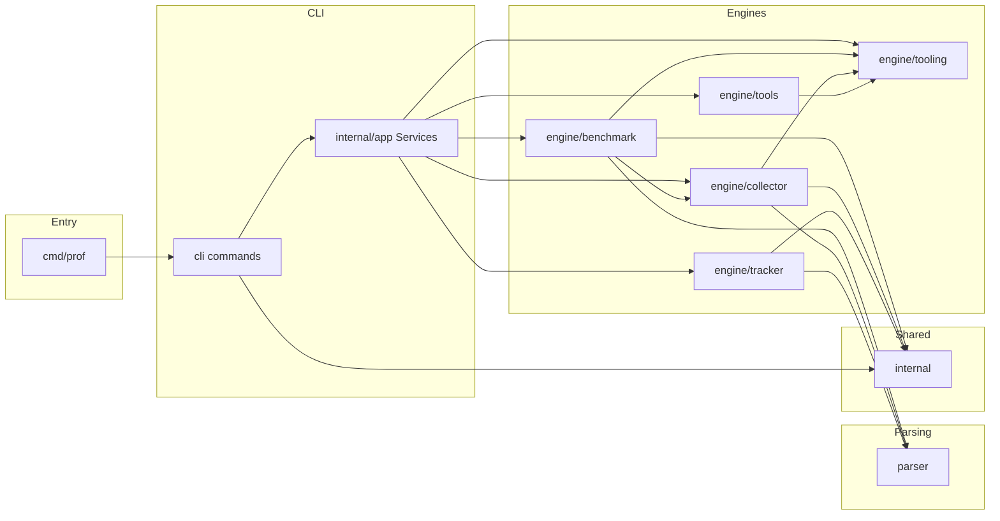

# Prof codebase design

Go benchmark profiling: wraps `go test` + pprof, writes `bench/<tag>/`, compares runs; interactive entry is `prof ui` / `prof tui` in [`cli`](cli) and [`internal/tui`](internal/tui).

## Purpose

- **Profile:** CPU, memory, mutex, block (`engine/benchmark`).
- **Layout:** `bench/<tag>/` (binaries, text, per-function snippets, optional package grouping).
- **Compare / CI:** `track` + optional `ci_config` in `config_template.json`.

## Architecture



**Composition root:** [`internal/app/services.go`](internal/app/services.go) defines narrow interfaces (`Benchmark`, `Collector`, `Tracker`, `Tools`, `Setup`) plus a shared [`tooling.Runner`](engine/tooling/runner.go) for subprocess execution. Defaults wire into `engine/*` in [`internal/app/defaults.go`](internal/app/defaults.go). Prefer adding behavior behind these interfaces when the CLI stays stable.

### Package layout (actual directories)

| Path | Role |
|------|------|
| [`cmd/prof`](cmd/prof) | `main`; delegates to `cli.Execute()` |
| [`cli`](cli) | Cobra commands, flags, TUI glue; calls `app.Services` |
| [`internal/app`](internal/app) | Composition root interfaces + default adapters; holds [`tooling.Runner`](engine/tooling/runner.go) |
| [`engine/tooling`](engine/tooling) | Subprocess [`Runner`](engine/tooling/runner.go), profile [`Catalog`](engine/tooling/catalog.go), `go tool pprof` argv helpers; in-process parsing stays in [`parser`](parser) |
| [`engine/benchmark`](engine/benchmark) | Layout, `go test -bench`, run pipeline, delegates artifact helpers to collector |
| [`engine/collector`](engine/collector) | `pprof` text/PNG/function list IO (via runner + tooling argv), manual ingest, package-grouped text |
| [`engine/tracker`](engine/tracker) | Load two profiles, diff, reports, CI filter application |
| [`engine/tools/benchstats`](engine/tools/benchstats), [`engine/tools/qcachegrind`](engine/tools/qcachegrind) | Optional tools on collected data |
| [`parser`](parser) | Binary pprof → [`ProfileData`](parser/types.go) / line objects; `Pipeline` for swappable stages |
| [`internal`](internal) | Shared **JSON config types** (in [`internal/types.go`](internal/types.go)), **wire args** (`BenchArgs`, `CollectionArgs`), **path constants** ([`internal/const.go`](internal/const.go)), **config/template helpers** ([`internal/api.go`](internal/api.go)) |
| [`internal/repofs`](internal/repofs) | **Module root lookup** (`go.mod`) and **tag dir** clean/create used by collectors and benchmarks |
| [`internal/testpaths`](internal/testpaths) | Test-only helpers to resolve paths under **`tests/assets`** |

Shared types live in **`internal`** as files (no separate `internal/config` package).

## Contributor map (where to start)

| Command | First files | Flow |
|---------|-------------|------|
| `prof auto` | [`cli/cmd_collect.go`](cli/cmd_collect.go) → [`engine/benchmark/entry.go`](engine/benchmark/entry.go) | Validate flags → load optional `config_template.json` → layout → `runBenchAndGetProfiles` |
| `prof manual` | [`cli/cmd_collect.go`](cli/cmd_collect.go) → [`engine/collector/manual_process.go`](engine/collector/manual_process.go) | Tag dir → per-file profile processing + function lists |
| `prof track auto` / `manual` | [`cli/cmd_track.go`](cli/cmd_track.go) → [`engine/tracker/run.go`](engine/tracker/run.go) | Build [`Selections`](engine/tracker/types.go) → compare → format output → CI apply |
| `prof ui` | [`cli/cmd_ui.go`](cli/cmd_ui.go), [`internal/tui/hub.go`](internal/tui/hub.go) | Bubble Tea menu → Survey / engines |
| `prof tui` | [`cli/cmd_tui.go`](cli/cmd_tui.go), [`cli/tui.go`](cli/tui.go) | Survey → same engines as above |
| `prof setup` | [`cli/cmd_setup.go`](cli/cmd_setup.go) → [`internal/api.go`](internal/api.go) `CreateTemplate` | Writes template JSON beside `go.mod` |
| `prof tools …` | [`cli/cmd_tools.go`](cli/cmd_tools.go) → `engine/tools/*` | Benchstat / qcachegrind helpers |

[`cli/discovery.go`](cli/discovery.go) lists tags and benchmarks **from existing `bench/` output** for TUI/track prompts; known profile names come from [`tooling.DefaultCatalog`](engine/tooling/catalog.go). Benchmark **source** discovery (`BenchmarkXxx` in `_test.go` files) lives in [`engine/benchmark/discovery.go`](engine/benchmark/discovery.go).

## Profile pipelines

### Automated benchmark (`prof auto`)

1. [`benchmark.RunBenchmarks`](engine/benchmark/entry.go) loads config via [`internal.LoadFromFile`](internal/api.go) (`config_template.json` at module root). Missing file → empty config; see logs in `entry.go`.
2. Prepares directories under `bench/<tag>/` (`layout.go`).
3. For each benchmark: run `go test` in the package directory that defines the benchmark ([`gotest.go`](engine/benchmark/gotest.go)), move profile binaries into `bench/<tag>/bin/<bench>/`.
4. [`processProfiles`](engine/benchmark/profiles.go) runs in order: text listing, optional package-grouped text, then PNG (Graphviz `dot`). Each step uses the shared [`tooling.Runner`](engine/tooling/runner.go). Then [`collectProfileFunctions`](engine/benchmark/pipeline.go) uses [`parser`](parser) + collector for per-function `pprof -list` output.

### Manual ingest (`prof manual`)

[`collector.RunCollector`](engine/collector/manual_process.go): cleans/creates tag dir, loads same JSON config, infers benchmark stem from filenames, emits text/grouped/function outputs. Does **not** run `go test`.

## Output layout

```
bench/
└── <tag>/
    ├── description.txt
    ├── bin/<BenchmarkName>/<BenchmarkName>_<profile>.out
    ├── text/<BenchmarkName>/<BenchmarkName>_<profile>.txt
    ├── <profile>_functions/<BenchmarkName>/<function>.txt (and optional .png under that tree when generated)
```

Exact names are centralized in [`internal/const.go`](internal/const.go) and path helpers in `engine/benchmark` / `engine/collector`.

## Configuration (`config_template.json`)

JSON shape is defined by [`internal.Config`](internal/types.go):

- **`function_collection_filter`**: Per-benchmark or global filter map entry using key `"*"` ([`internal.GlobalSign`](internal/const.go)). Each entry is a [`FunctionFilter`](internal/types.go) with `include_prefixes` and `ignore_functions` (short names after the last `.`).
- **`ci_config`**: Optional thresholds and ignore lists for **`prof track`** ([`engine/tracker/ci_apply.go`](engine/tracker/ci_apply.go)).

Generate a starter file with **`prof setup`**.

## Known sharp edges

- **Grouped reports (`--group-by-package`)**: [`prof auto`](engine/benchmark/profiles.go) currently passes an **empty** filter into grouped markdown generation; **`prof manual`** uses the **resolved** filter from config ([`manual_process.go`](engine/collector/manual_process.go)). Outputs can differ between flows; intentional changes need tests + changelog.
- **Optional config**: Absent `config_template.json` is allowed; collection uses unfiltered defaults where applicable.
- **PNG**: Requires Graphviz **`dot`** on `PATH`. The CLI exposes **`--skip-png`** to treat PNG failure as non-fatal; default is strict.
- **Profiles on disk**: With strict mode (default), missing expected `.out` files after a bench run fail the command; **`--lenient-profiles`** restores warn-and-continue for missing binaries.

## Error handling (project rules)

- Return **`error`** from operations that fail; wrap with **`fmt.Errorf("…: %w", err)`** so callers can use **`errors.Is` / `As`**.
- Do not treat real failures as **`slog.Info`**; optional behavior must be **flag-driven** (see `--skip-png`, `--lenient-profiles`) or documented as explicitly best-effort.
- The **`prof track`** HTML/JSON formatters propagate write failures to the CLI (non-zero exit).

## Dependencies (high level)

- **spf13/cobra**: CLI structure
- **AlecAivazis/survey/v2**: TUI prompts
- **google/pprof**: Profile decode (via [`parser`](parser)); external `go tool pprof` invocations are argv-built in [`engine/tooling`](engine/tooling) and executed through [`tooling.Runner`](engine/tooling/runner.go)

## Testing

- **`go test ./...`**: Unit tests under `cli`, `engine/*`, `parser`, `internal`, plus [`tests/blackbox_test.go`](tests/blackbox_test.go) for coarse integration checks.
- **Lint:** **`forbidigo`** (see [`.golangci.yml`](.golangci.yml)) blocks `exec.Command` / `exec.CommandContext` outside [`engine/tooling/exec_runner.go`](engine/tooling/exec_runner.go), [`engine/tooling/exec_spawn.go`](engine/tooling/exec_spawn.go), and the **`tests/`** package so subprocess policy stays enforceable.
- Fixture-style environments sometimes live under `tests/` directories with spaces in names—run tests from repo root.

## Design principles

1. **Engines own orchestration**; **`cli` stays thin**.
2. **Parser** stays toolkit-oriented (`Pipeline`, path facades).
3. **Config over magic**: JSON drives filters and CI behavior.
4. **Strict by default**: failures surface to the user unless an explicit flag opts into lenience.
