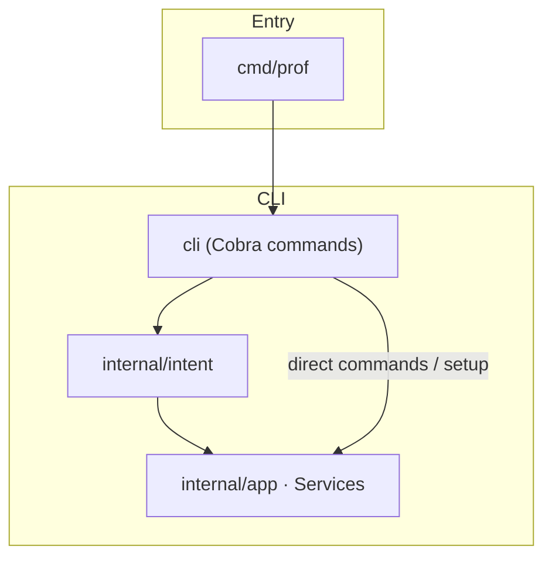
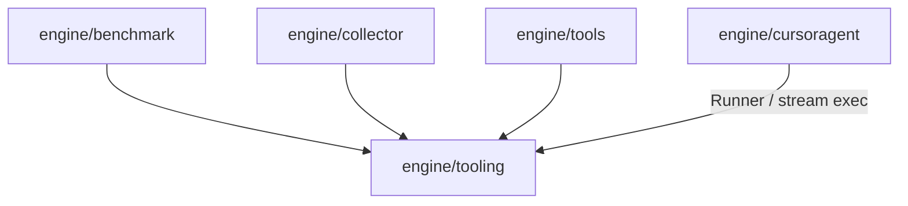
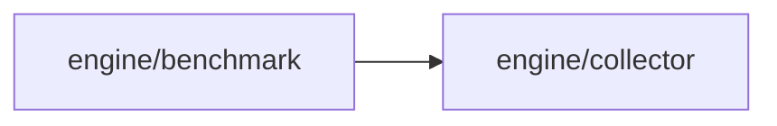
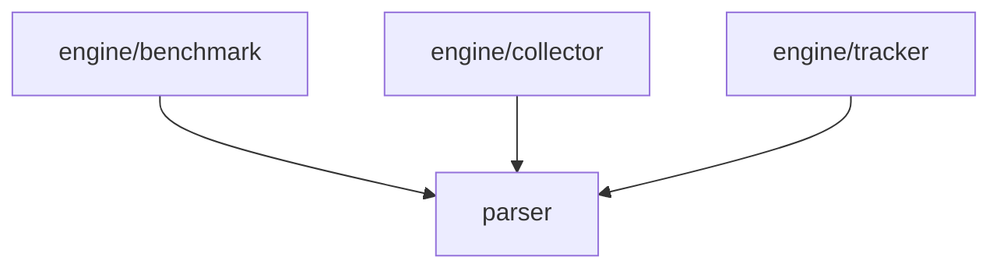
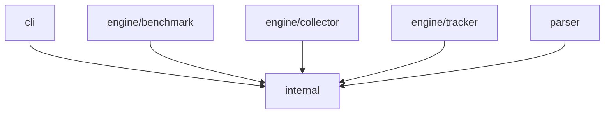

# Prof codebase design

**Prof codebase design** is a contributor map of packages, entrypoints, and call flow so you can change the `prof` CLI or the profiling engines without reading the entire repository.

> **Note:** This page is for people editing the Go codebase. For installing and running Prof as a user, read [readme.md](readme.md).

## Before you begin

- Run tests from the **repository root** (`go test ./...`). Some packages resolve fixtures under `tests/`.
- **Subprocess policy:** do not add `exec.Command` / `exec.CommandContext` outside [`engine/tooling/exec_runner.go`](engine/tooling/exec_runner.go), [`engine/tooling/exec_spawn.go`](engine/tooling/exec_spawn.go), or the `tests/` tree. CI enforces this via `forbidigo` in [`.golangci.yml`](.golangci.yml).

## How to use this page

Stop when your question is answered. **Below, sections follow the same order as this list:** structure first (who calls whom, then each folder’s role), then how commands map to files, then on-disk and JSON behavior, then policies.

1. **See how packages depend on each other** → [How packages connect at runtime](#how-packages-connect-at-runtime)
2. **Look up what a directory is for** → [Package layout (by path)](#package-layout-by-path)
3. **Change a command or UI flow** → [How to find the code for each command](#how-to-find-the-code-for-each-command)
4. **Change on-disk output or JSON / pipeline behavior** → [Profile pipelines](#profile-pipelines), [Output layout under `bench/`](#output-layout-under-bench), [Configuration (`config_template.json`)](#configuration-config_templatejson)
5. **Avoid surprises** (errors, tests, lint, major deps, design constraints) → [Error handling (project rules)](#error-handling-project-rules), [Known sharp edges](#known-sharp-edges), [Dependencies (high level)](#dependencies-high-level), [Testing and lint policy](#testing-and-lint-policy), [Design principles](#design-principles)

## How packages connect at runtime

**Why read this first:** it answers “who calls whom” in a few small figures. Everything after assumes you know: **`cli` → `app.Services` (interfaces in [`internal/app/services.go`](internal/app/services.go), defaults in [`internal/app/defaults.go`](internal/app/defaults.go))**, **`engine/tooling`** for subprocesses, **`parser`** for in-process profile decode, **`internal`** for JSON and path constants. Guided UIs go through **`internal/intent`** before `app`. **[`engine/cursoragent`](engine/cursoragent)** uses **`tooling`** only; it is not wired through `app` or the `prof` CLI yet.

The installable binary is `go install …/cmd/prof@latest`. [`cmd/prof/main.go`](cmd/prof/main.go) calls [`cli.Execute`](cli/api.go).

### Entry → CLI → `app`



### Engines → `engine/tooling` (subprocess)



### `prof auto`: benchmark → collector



### Who uses `parser` (in-process decode)



### Who imports `internal` (shared types / paths)



**Defaults:** `app.Services` wires to `engine/benchmark`, `engine/collector`, `engine/tracker`, `engine/tools`, and `engine/tooling` (not `cursoragent`). The package table below is the same list with roles.

## Package layout (by path)

**Why this section:** the diagrams show edges only; here is every important directory in one place (single source of truth for “what lives where”).

| Path | Role |
|------|------|
| [`cmd/prof/main.go`](cmd/prof/main.go) | `main`; delegates to [`cli.Execute`](cli/api.go) |
| [`cli`](cli) | Cobra commands, flags, glue to Bubble Tea / Survey; calls `app.Services` |
| [`internal/app`](internal/app) | Composition root interfaces and default adapters; holds [`tooling.Runner`](engine/tooling/runner.go) |
| [`internal/intent`](internal/intent) | Validates UI-shaped input and maps it to [`app.Services`](internal/app/services.go) (`CollectIntent`, `CompareIntent`, tools, setup); see package `doc.go` |
| [`internal/tui`](internal/tui) | Bubble Tea hub for `prof ui`; calls `intent` / `app` |
| [`engine/tooling`](engine/tooling) | Subprocess `Runner`, stream exec, `Catalog`, `go tool pprof` argv construction |
| [`engine/cursoragent`](engine/cursoragent) | Non-interactive `cursor-agent` driver ([`Client`](engine/cursoragent/client.go)); not wired into the `prof` CLI yet |
| [`engine/benchmark`](engine/benchmark) | `go test` orchestration, `bench/<tag>/` layout, delegates collector-style processing |
| [`engine/collector`](engine/collector) | pprof text, PNG, grouped text, manual ingest, function list IO (via runner and tooling argv) |
| [`engine/tracker`](engine/tracker) | Load two profiles, diff, reports, apply `ci_config` |
| [`engine/tools/benchstats`](engine/tools/benchstats), [`engine/tools/qcachegrind`](engine/tools/qcachegrind) | Optional post-process tools on collected data |
| [`parser`](parser) | Binary pprof → structured data; `Pipeline` for swappable stages |
| [`internal`](internal) | Shared JSON types, `BenchArgs` / collection wiring, path constants, template helpers |
| [`internal/repofs`](internal/repofs) | Resolve module root (`go.mod`) and tag directories |
| [`internal/testpaths`](internal/testpaths) | Test-only helpers under `tests/assets` |

Shared types live as files under `internal` (there is no separate `internal/config` package).

## How to find the code for each command

**Why this section:** you already know *where* packages live; this maps *subcommands* to the first files to open and the rough call path.

| Command | First files | Flow |
|---------|-------------|------|
| `prof auto` | [`cli/cmd_collect.go`](cli/cmd_collect.go) → [`engine/benchmark/entry.go`](engine/benchmark/entry.go) | Validate flags, optional `config_template.json`, layout, `runBenchAndGetProfiles` |
| `prof manual` | [`cli/cmd_collect.go`](cli/cmd_collect.go) → [`engine/collector/manual_process.go`](engine/collector/manual_process.go) | Tag dir, per-file profile processing and function lists |
| `prof track auto` / `manual` | [`cli/cmd_track.go`](cli/cmd_track.go) → [`engine/tracker/run.go`](engine/tracker/run.go) | Build [`Selections`](engine/tracker/types.go), compare, format output, CI apply |
| `prof ui` | [`cli/cmd_ui.go`](cli/cmd_ui.go), [`internal/tui/hub.go`](internal/tui/hub.go), [`internal/intent`](internal/intent) | Bubble Tea menu and Survey prompts; intents → `app.Services` |
| `prof tui` | [`cli/cmd_tui.go`](cli/cmd_tui.go), [`cli/tui.go`](cli/tui.go) | Survey-driven flow; same engines as `prof auto` / track |
| `prof setup` | [`cli/cmd_setup.go`](cli/cmd_setup.go) → [`internal/api.go`](internal/api.go) `CreateTemplate` | Writes template JSON beside `go.mod` |
| `prof tools …` | [`cli/cmd_tools.go`](cli/cmd_tools.go) → `engine/tools/*` | Benchstat and qcachegrind |

[`cli/discovery.go`](cli/discovery.go) lists tags and benchmarks from existing `bench/` output for prompts. Profile names come from [`tooling.DefaultCatalog`](engine/tooling/catalog.go). Benchmark name discovery (`BenchmarkXxx` in `_test.go` files) lives in [`engine/benchmark/discovery.go`](engine/benchmark/discovery.go).

### What `prof ui` covers compared to the raw CLI

**Why this subsection:** hub work stays in sync with flags-only commands only if contributors know what stays CLI-only.

| Capability | CLI / TUI entry | In `prof ui`? | Notes |
|------------|-----------------|---------------|-------|
| Automated benchmark collect | `prof auto`, `prof tui`, hub “Run benchmarks…” | Yes | `CollectIntent` → `Benchmark.RunBenchmarks` |
| Compare two tagged runs | `prof track auto`, compare hub | Yes | `CompareIntent` → `Tracker.RunTrackAuto` |
| Manual profile ingest | `prof manual <files> --tag …` | No | Needs argv paths |
| Compare arbitrary profile text | `prof track manual …` | No | Path-based |
| Benchstat | `prof tools benchstat …` | Yes | `ToolsBenchstatIntent` → `Tools.RunBenchStats` |
| Qcachegrind | `prof tools qcachegrind …` | Yes | `ToolsQcachegrindIntent` → `Tools.RunQcacheGrind` |
| Write config template | `prof setup` | Yes | `SetupIntent` → `Setup.CreateTemplate` |

New hub actions: extend [`internal/intent`](internal/intent) (see its `doc.go` catalog).

## Profile pipelines

**Why this section:** the diagrams name packages; here is the **ordered** behavior for the two collect flows (`prof auto` vs `prof manual`) when you need to trace a bug or add a stage.

### Automated benchmark (`prof auto`)

1. [`benchmark.RunBenchmarks`](engine/benchmark/entry.go) loads optional `config_template.json` via [`internal.LoadFromFile`](internal/api.go). Missing file → empty config (see logging in `entry.go`).
2. Creates `bench/<tag>/` via [`layout.go`](engine/benchmark/layout.go).
3. For each benchmark, runs `go test` in the defining package ([`gotest.go`](engine/benchmark/gotest.go)), writes binaries under `bench/<tag>/bin/<bench>/`.
4. [`processProfiles`](engine/benchmark/profiles.go): text listing, optional grouped text, PNG via Graphviz `dot` (via [`tooling.Runner`](engine/tooling/runner.go)). [`collectProfileFunctions`](engine/benchmark/pipeline.go) uses [`parser`](parser) and collector paths for `pprof -list` style output.

### Manual ingest (`prof manual`)

[`collector.RunCollector`](engine/collector/manual_process.go): creates or cleans tag dir, loads JSON config, infers benchmark stem from filenames, emits text, grouped, and function outputs. Does not run `go test`.

## Output layout under `bench/`

**Why this section:** the pipelines above write here; this is the directory shape (filenames are centralized in code, not repeated here).

```text
bench/
└── <tag>/
    ├── description.txt
    ├── bin/<BenchmarkName>/<BenchmarkName>_<profile>.out
    ├── text/<BenchmarkName>/<BenchmarkName>_<profile>.txt
    ├── <profile>_functions/<BenchmarkName>/<function>.txt
```

[`internal/const.go`](internal/const.go) and helpers in `engine/benchmark` / `engine/collector` define exact names.

## Configuration (`config_template.json`)

**Why this section:** once you know where config is loaded (see `prof auto` step 1), these fields are what actually change collection and track behavior.

[`internal.Config`](internal/types.go) defines the JSON shape, including:

- **`function_collection_filter`**: per-benchmark or global map; global key is [`internal.GlobalSign`](internal/const.go) (`"*"`). Each entry is a [`FunctionFilter`](internal/types.go) with `include_prefixes` and `ignore_functions` (short names after the last `.`).
- **`ci_config`**: optional thresholds and ignore lists for `prof track` ([`engine/tracker/ci_apply.go`](engine/tracker/ci_apply.go)).

Template creation: [`cli/cmd_setup.go`](cli/cmd_setup.go) → [`internal/api.go`](internal/api.go). Operator-facing CI details: [docs/cicd_configuration.md](docs/cicd_configuration.md).

## Error handling (project rules)

**Why this section:** code style for errors after you have located the right package.

- Return `error`; wrap with `fmt.Errorf("…: %w", err)` so callers can use `errors.Is` and `errors.As`.
- Do not downgrade real failures to `slog.Info`. Optional behavior uses explicit flags (`--skip-png`, `--lenient-profiles`, …) or documented best-effort paths.
- `prof track` HTML and JSON formatters propagate write failures to the CLI (non-zero exit).

## Known sharp edges

**Why this section:** documented behavior that looks like a bug but is intentional or easy to trip over.

- **Grouped reports** (`--group-by-package`): [`prof auto`](engine/benchmark/profiles.go) passes an empty filter into grouped package generation; [`prof manual`](engine/collector/manual_process.go) uses the resolved filter from config. Outputs can differ until flows are unified intentionally (needs tests + changelog if you change it).
- **Missing `config_template.json`** is allowed; collection uses unfiltered defaults where applicable.
- **PNG** requires Graphviz `dot` on `PATH`. `--skip-png` treats PNG failure as non-fatal; default is strict.
- **Strict profiles** (default): missing expected `.out` files after a bench run fail the command; `--lenient-profiles` continues with a warning.

## Dependencies (high level)

**Why this section:** external libraries worth grepping for when you touch UI or profiles.

| Dependency | Role in this repo |
|--------------|-------------------|
| `spf13/cobra` | Command tree and flags |
| `charmbracelet/bubbletea` (`cli`, `internal/tui`) | `prof ui` full-screen flows |
| `AlecAivazis/survey/v2` | Prompts for `prof tui` and parts of `prof ui` |
| `github.com/google/pprof` (via [`parser`](parser)) | In-process decoding; external `go tool pprof` runs go through [`engine/tooling`](engine/tooling) and [`Runner`](engine/tooling/runner.go) |

## Testing and lint policy

**Why this section:** how CI expects you to run tests and where subprocess calls are allowed.

- **`go test ./...`**: unit tests under `cli`, `engine/*`, `parser`, `internal`, plus [`tests/blackbox_test.go`](tests/blackbox_test.go) for coarse integration checks.
- **`forbidigo`** in [`.golangci.yml`](.golangci.yml): blocks `exec.Command` / `exec.CommandContext` outside [`engine/tooling/exec_runner.go`](engine/tooling/exec_runner.go), [`engine/tooling/exec_spawn.go`](engine/tooling/exec_spawn.go), and the `tests/` package.

Some fixtures live under `tests/` directories with spaces in names; run tests from the repo root.

## Design principles

**Why this section:** high-level constraints when a change could go multiple directions.

1. Engines own orchestration; keep `cli` thin.
2. Keep `parser` toolkit-shaped (`Pipeline`, path facades).
3. Prefer JSON-driven behavior over hidden defaults.
4. Default to strict CLI exits; use explicit flags for lenience.

## Related resources

- [readme.md](readme.md) — what Prof is and how to run it
- [CONTRIBUTING.md](CONTRIBUTING.md) — patch workflow and review expectations
- [prof_web_doc/](prof_web_doc/) — published documentation site source
- [docs/cicd_configuration.md](docs/cicd_configuration.md) — machine-readable CI schema and examples for operators
