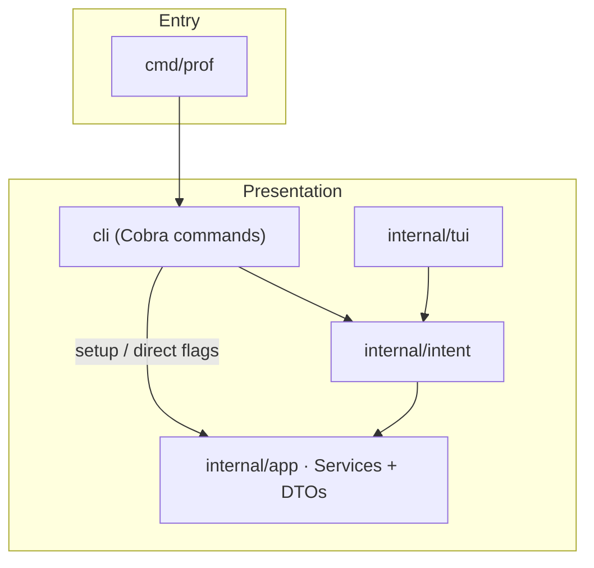
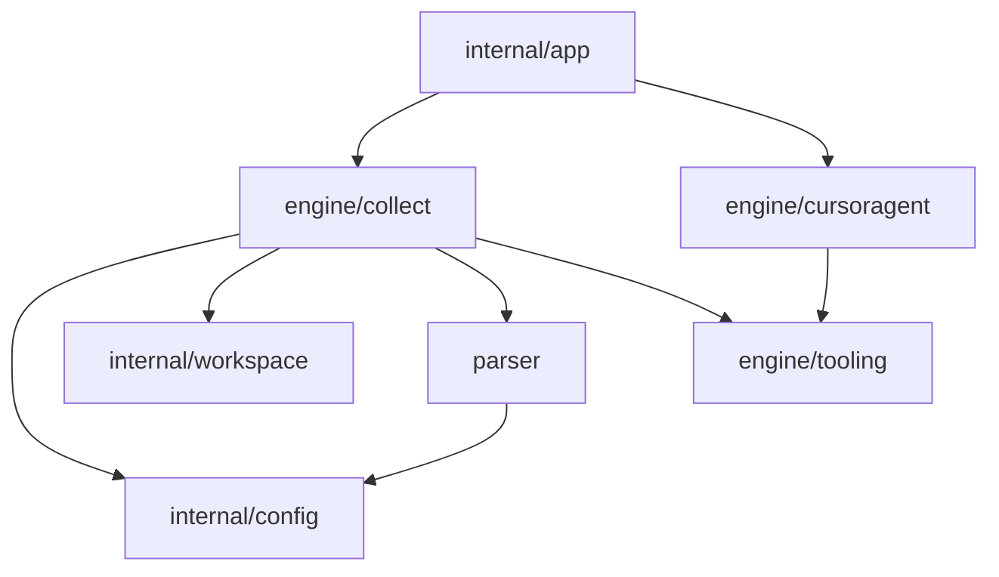

# Prof codebase design

**Prof codebase design** is a contributor map of packages, entrypoints, and call flow so you can change the `prof` CLI or the profiling engines without reading the entire repository.

> **Note:** This page is for people editing the Go codebase. For installing and running Prof as a user, read [readme.md](readme.md).

## Before you begin

- Run tests from the **repository root** (`go test ./...`). Some packages resolve fixtures under `tests/`.
- **Subprocess policy:** do not add `exec.Command` / `exec.CommandContext` outside [`engine/tooling/exec_runner.go`](engine/tooling/exec_runner.go), [`engine/tooling/lookpath.go`](engine/tooling/lookpath.go), or the `tests/` tree. CI enforces this via `forbidigo` and `depguard` in [`.golangci.yml`](.golangci.yml).
- **Layering:** `cli`, `internal/intent`, and `internal/tui` import [`internal/app`](internal/app) only — not `engine/*` directly. Engine types cross the boundary as DTOs in [`internal/app/dto.go`](internal/app/dto.go).

## How to use this page

1. **See how packages depend on each other** → [How packages connect at runtime](#how-packages-connect-at-runtime)
2. **Look up what a directory is for** → [Package layout (by path)](#package-layout-by-path)
3. **Change a command or UI flow** → [How to find the code for each command](#how-to-find-the-code-for-each-command)
4. **Change on-disk output or JSON / pipeline behavior** → [Profile pipelines](#profile-pipelines), [Output layout under `bench/`](#output-layout-under-bench), [Configuration](#configuration-profjson)
5. **Avoid surprises** → [Invariants](#invariants), [Edge-case catalog](#edge-case-catalog), [Testing and lint policy](#testing-and-lint-policy)

## How packages connect at runtime

The installable binary is `go install …/cmd/prof@latest`. [`cmd/prof/main.go`](cmd/prof/main.go) calls [`cli.Execute`](cli/api.go).

### Entry → CLI → `app`



### Engines → kernel → tooling



**Defaults:** [`app.Default()`](internal/app/defaults.go) wires `engine/collect`, `engine/cursoragent`, and `internal/config` (setup template).

## Package layout (by path)

| Path | Role |
|------|------|
| [`cmd/prof`](cmd/prof) | `main`; delegates to `cli.Execute` |
| [`cli`](cli) | Cobra commands, per-command flag structs, Survey/TUI glue |
| [`internal/app`](internal/app) | Composition root: `Services`, DTOs, default adapters |
| [`internal/intent`](internal/intent) | Validates UI-shaped input (`CollectIntent`, config intents) |
| [`internal/tui`](internal/tui) | Bubble Tea hub for `prof ui` |
| [`internal/config`](internal/config) | `prof.json` types, Load/Save/Validate, resolvers |
| [`internal/workspace`](internal/workspace) | `TagLayout`, tag lifecycle, module root, path constants |
| [`engine/collect`](engine/collect) | Unified auto + manual collection (`RunAuto`, `RunManual`) |
| [`engine/tooling`](engine/tooling) | Subprocess `Runner`, profile catalog, `go tool pprof` argv |
| [`engine/cursoragent`](engine/cursoragent) | Optional `cursor-agent` driver via `app.Agent` |
| [`parser`](parser) | In-process pprof decode; imports `internal/config` for filters only |

## How to find the code for each command

| Command | First files | Flow |
|---------|-------------|------|
| `prof auto` | [`cli/cmd_collect.go`](cli/cmd_collect.go) → [`engine/collect/entry.go`](engine/collect/entry.go) | Flags → `app.CollectAutoOptions` → layout → `go test` → artifacts |
| `prof manual` | [`cli/cmd_collect.go`](cli/cmd_collect.go) → [`engine/collect/manual.go`](engine/collect/manual.go) | Same `TagLayout` as auto; infers bench/profile from filename |
| `prof ui` | [`cli/cmd_ui.go`](cli/cmd_ui.go), [`internal/tui`](internal/tui), [`internal/intent`](internal/intent) | Intents → `app.Services`; see [docs/collect-request-flow.md](docs/collect-request-flow.md) for collect |
| `prof tui` | [`cli/tui.go`](cli/tui.go) | Survey prompts → collect intent; see [docs/collect-request-flow.md](docs/collect-request-flow.md) |
| `prof config init` | [`cli/cmd_config.go`](cli/cmd_config.go) → [`internal/config/load.go`](internal/config/load.go) | Writes `prof.json` beside `go.mod` |
| `prof setup` | [`cli/cmd_setup.go`](cli/cmd_setup.go) | Hidden alias for `prof config init` |

Benchmark discovery: [`engine/collect/discovery.go`](engine/collect/discovery.go). Profile names: [`engine/tooling/catalog.go`](engine/tooling/catalog.go) via [`collect.SupportedProfiles`](engine/collect/options.go).

## Profile pipelines

### Automated benchmark (`prof auto`)

1. [`collect.RunAuto`](engine/collect/entry.go) loads optional `prof.json` via [`config.Load`](internal/config/load.go).
2. Creates `bench/<tag>/` via [`collect/layout.go`](engine/collect/layout.go) and [`workspace.CleanOrCreateTag`](internal/workspace/tag.go).
3. Runs `go test` per benchmark ([`gotest.go`](engine/collect/gotest.go)), writes binaries under `bench/<tag>/bin/<bench>/`.
4. [`processProfiles`](engine/collect/profiles.go): text, PNG, per-function lists.

### Manual ingest (`prof manual`)

[`collect.RunManual`](engine/collect/manual.go): cleans tag dir, copies binaries into auto layout, emits the same artifact types. Does not run `go test`.

## Output layout under `bench/`

All paths come from [`workspace.TagLayout`](internal/workspace/layout.go):

```text
bench/
└── <tag>/
    ├── description.txt
    ├── bin/<BenchmarkName>/<BenchmarkName>_<profile>.out
    ├── text/<BenchmarkName>/<BenchmarkName>_<profile>.txt
    └── <profile>_functions/<BenchmarkName>/<function>.txt
```

## Configuration (`prof.json`)

[`internal/config`](internal/config) defines version 1 JSON beside `go.mod`:

- **`collection`**: `defaults`, `benchmarks` (prof auto), `manual_profiles` (prof manual). Resolved via [`config.ResolveCollectionFilter`](internal/config/filter.go).

Edit interactively: `prof ui` → Create Configuration File. CLI: `prof config init|validate|path`.

## Invariants

1. **Single layout contract:** auto and manual both use `workspace.TagLayout`; no duplicate path builders in engines.
2. **Config is optional:** missing `prof.json` → empty filter; collection proceeds with logging.
3. **Subprocesses only via tooling:** product code uses [`tooling.Runner`](engine/tooling/runner.go); raw `os/exec` is limited to tooling and tests (enforced by `forbidigo` + `depguard`).
4. **Presentation boundary:** CLI/intent/tui pass `app` DTOs; engines are reached only through `app.Services` defaults or test stubs.

## Edge-case catalog

| Symptom | Package | Test / note |
|---------|---------|-------------|
| Missing profile binary after bench | `engine/collect` | `--lenient-profiles` skips; default fails |
| PNG / Graphviz missing | `engine/collect` | `--skip-png` warns; default fails |
| Manual file `cpu.out` → bench `cpu` | `engine/collect` | [`manual_test.go`](engine/collect/manual_test.go) stem rules |
| Tag dir not empty before run | `internal/workspace` | [`layout_test.go`](internal/workspace/layout_test.go) `CleanOrCreateTag` |
| Per-bench overrides collection defaults | `internal/config` | [`config_test.go`](internal/config/config_test.go) |

## Testing and lint policy

- **`go test ./...`** from repo root; integration harness in [`tests/`](tests/).
- **`forbidigo`:** blocks raw `exec.Command*` outside sanctioned files.
- **`depguard` layering:** `cli` / `intent` / `tui` must not import `engine/*`; `parser` must not import `workspace` or `cli`.
- **`depguard` exec:** non-test code outside `engine/tooling` must not import `os/exec`.
- **`tagliatelle`:** JSON struct tags in `internal/config` use `snake_case`.
- **`loggercheck`:** `slog` key-value pairs in pipeline code.
- **`thelper`:** enabled except under `tests/` integration harness.

## Design principles

1. Engines own orchestration; keep `cli` thin.
2. One collect engine, one layout, one config loader.
3. Prefer JSON-driven behavior over hidden defaults.
4. Default to strict CLI exits; use explicit flags for lenience.

## Related resources

- [readme.md](readme.md) — user-facing install and usage
- [docs/collect-request-flow.md](docs/collect-request-flow.md) — internal flow for interactive collect (`prof tui` / `prof ui`)
- [CONTRIBUTING.md](CONTRIBUTING.md) — patch workflow
