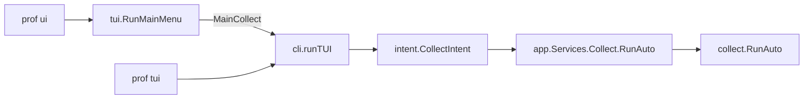
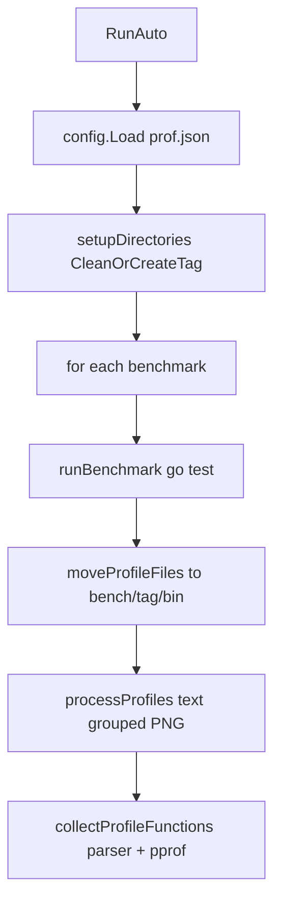

# Interactive collect request flow

**Content type:** Explanation — internal call chain for one workflow, not a user tutorial.

This page traces what happens **inside prof** when you run interactive benchmark collection: the Survey prompts from `prof tui`, or **Run Benchmarks & Collect Profiles** in `prof ui`. It complements [CODEBASE_DESIGN.md](../CODEBASE_DESIGN.md) (package map) and the user guides in [prof_web_doc/docs/tui.md](../prof_web_doc/docs/tui.md) and [prof_web_doc/docs/collect.md](../prof_web_doc/docs/collect.md).

## How to use this page

1. **See which command you entered** → [Scope](#scope)
2. **Map a Survey prompt to code** → [Prompt → code mapping](#prompt--code-mapping)
3. **Follow execution after you confirm the last prompt** → [Engine pipeline](#engine-pipeline)
4. **Know what lands on disk** → [Output layout (example)](#output-layout-example)
5. **Find the right file to edit** → [Where to change behavior](#where-to-change-behavior)

## Before you begin

- You know Go module layout and that prof writes under `bench/<tag>/`.
- For installing and running prof as a user, read [readme.md](../readme.md) and [prof_web_doc/docs/tui.md](../prof_web_doc/docs/tui.md).
- For package boundaries and invariants, read [CODEBASE_DESIGN.md](../CODEBASE_DESIGN.md).

## Scope

This page covers **interactive collect only**:

| Entry | First code |
| --- | --- |
| `prof tui` | [`cli/tui.go`](../cli/tui.go) `runTUI` |
| `prof ui` → **Run Benchmarks & Collect Profiles** | [`internal/tui/hub.go`](../internal/tui/hub.go) `RunMainMenu` → [`cli/cmd_ui.go`](../cli/cmd_ui.go) → `runTUI` |

`prof auto` skips Survey and [`internal/intent`](../internal/intent), but both paths call the same engine entry point:

| Path | Presentation | Engine |
| --- | --- | --- |
| `prof tui` / `prof ui` collect | Survey → `CollectIntent` → `intent.RunValidated` | `app.Services.Collect.RunAuto` → `collect.RunAuto` |
| `prof auto` | Cobra flags in [`cli/cmd_collect.go`](../cli/cmd_collect.go) | Same `collect.RunAuto` |

**Note:** Only `prof ui` returns to the Bubble Tea hub after collect. [`finishUIWorkflow`](../cli/cmd_ui.go) prints errors to stderr, then asks **Return to main menu?** via `promptReturnToHub`. `prof tui` exits when `runTUI` returns.

## Running example

The walkthrough below uses these choices (from a typical interactive session):

- **Benchmark:** `BenchmarkMatrixMultiplication`
- **Profiles:** `cpu`, `memory`
- **Count:** `5`
- **Tag:** `Baseline`
- **Advanced options:** group-by-package **No**, lenient profiles **Yes**, skip PNG **Yes**

## Entry paths



**Key files**

- Hub menu: [`internal/tui/hub.go`](../internal/tui/hub.go) — Bubble Tea full-screen menu; `MainCollect` dispatches to `runTUI` from [`cli/cmd_ui.go`](../cli/cmd_ui.go).
- Survey wizard: [`cli/tui.go`](../cli/tui.go) — all collect prompts and `CollectIntent` construction.
- Intent boundary: [`internal/intent/collect.go`](../internal/intent/collect.go), [`internal/intent/kind.go`](../internal/intent/kind.go) (`RunValidated`).

## Prompt → code mapping

Each Survey step maps to a function, validation rule, and field on [`CollectIntent`](../internal/intent/collect.go):

| Prompt (as shown) | Code | `CollectIntent` field |
| --- | --- | --- |
| Select benchmarks to run | `svc.Collect.DiscoverBenchmarks(cwd)` → [`scanForBenchmarks`](../engine/collect/discovery.go) | `Benchmarks` |
| Collection filters: none / from prof.json | [`printCollectionFilterPreview`](../cli/collect_preview.go) | *(preview only — not stored on intent)* |
| Select profiles | `svc.Collect.SupportedProfiles()` | `Profiles` |
| Number of runs (count) | `strconv.Atoi` in `runTUI` | `Count` |
| Tag name | Survey input | `Tag` |
| Advanced options | [`askAdvancedCollectOptions`](../cli/collect_preview.go) | `GroupByPackage`, `LenientProfiles`, `SkipPNG` |

**Prompt effects**

| Prompt | Effect |
| --- | --- |
| Select benchmarks | Regex scan of `*_test.go` under cwd; skips `vendor`, `bench`, `tests`, and nested `go.mod` trees |
| Collection filters line | Read-only preview via `config.Load` + `ResolveCollectionFilter`; does not block the run |
| Select profiles | Profile IDs from [`engine/tooling/catalog.go`](../engine/tooling/catalog.go) |
| Number of runs | Rejects count `< 1` in `runTUI` before intent validation |
| Tag name | Trimmed tag becomes `bench/<tag>/` via [`workspace.TagLayout`](../internal/workspace/layout.go) |
| Advanced options | See [Advanced options defaults](#advanced-options-defaults) |

`CollectIntent.Run` copies fields into `app.CollectAutoOptions` ([`internal/app/dto.go`](../internal/app/dto.go)) with the same names before calling `collect.RunAuto`.

### Advanced options defaults

When you answer **No** to **Advanced options**, [`askAdvancedCollectOptions`](../cli/collect_preview.go) still sets `SkipPNG` to `true` when Graphviz is unavailable — you do not get separate prompts for group-by-package or lenient profiles (both stay `false`).

When you answer **Yes**, you get three confirms. `SkipPNG` defaults to `true` when Graphviz is missing; if you leave it `false` without Graphviz, prof prints `SkipPNGNotice` and forces skip PNG before building the intent. [`runTUI`](../cli/tui.go) repeats the Graphviz check after advanced options return.

### After the last prompt

1. `collect.Normalize()` trims the tag and drops empty benchmark/profile entries.
2. `intent.RunValidated(collect, svc)` calls `Validate()` then `Run()`.
3. `CollectIntent.Run` calls `svc.Collect.RunAuto` ([`internal/app/defaults.go`](../internal/app/defaults.go)), which delegates to [`collect.RunAuto`](../engine/collect/entry.go).

## Engine pipeline

Once `RunAuto` runs, the same pipeline executes for every selected benchmark. The flow below is the internal request path after your Survey answers are committed.



### 1. Validate and prepare

[`collect.RunAuto`](../engine/collect/entry.go):

- Rejects empty benchmarks/profiles and count `< 1`.
- Calls `applyAutoSkipPNG` — if Graphviz is unavailable and skip PNG was not set, enables `SkipPNG` and logs a notice (second guard after the Survey layer).
- Loads optional `prof.json` via [`config.Load`](../internal/config/load.go). Missing config is non-fatal; collection proceeds with empty filters.

### 2. Create output layout

[`setupDirectories`](../engine/collect/layout.go):

- Resolves `bench/<tag>/` with [`workspace.CleanOrCreateTag`](../internal/workspace/tag.go).
- Creates `bin/<benchmark>/`, `text/<benchmark>/`, `<profile>_functions/<benchmark>/`, and `description.txt`.

### 3. Run benchmark (`go test`)

For `BenchmarkMatrixMultiplication`, [`runBenchmark`](../engine/collect/gotest.go):

- Locates the package directory containing the benchmark function.
- Builds `go test -run=^$ -bench=^BenchmarkMatrixMultiplication$ -benchmem -count=5` plus profile flags from the tooling catalog (`cpu`, `memory`).
- Runs the command in the benchmark package directory via [`tooling.Runner`](../engine/tooling/runner.go).
- Writes combined benchmark output to the tag layout and moves profile binaries (`.out`) into `bench/Baseline/bin/BenchmarkMatrixMultiplication/` via [`moveProfileFiles`](../engine/collect/artifacts.go).

### 4. Process profiles

[`processProfiles`](../engine/collect/profiles.go) runs per profile (`cpu`, then `memory`):

| Step | Output | Notes for this example |
| --- | --- | --- |
| Stat binary | — | **Lenient profiles Yes:** missing `.out` logs a warning and skips that profile instead of failing |
| Text profile | `text/.../BenchmarkMatrixMultiplication_cpu.txt` (and `_memory.txt`) | Via `go tool pprof` |
| Grouped text | `*_grouped.txt` | **Group by package No:** this branch is skipped |
| PNG | `<profile>_functions/.../BenchmarkMatrixMultiplication.png` | **Skip PNG Yes:** PNG failure logs a warning; run still succeeds if text profiles were produced |

Resolved function filters for each benchmark come from `config.ResolveCollectionFilter` (same rules previewed during the Survey step).

### 5. Per-function extracts

[`collectProfileFunctions`](../engine/collect/pipeline.go):

- For each successfully processed profile, [`parser.GetFunctionListEntriesV2`](../parser/) reads the binary and applies config filters.
- `go tool pprof -list` output is written under `cpu_functions/BenchmarkMatrixMultiplication/` and `memory_functions/BenchmarkMatrixMultiplication/`.

When all benchmarks finish, prof logs collection success and returns.

## Output layout (example)

All paths come from [`workspace.TagLayout`](../internal/workspace/layout.go). For the running example:

```text
bench/
└── Baseline/
    ├── description.txt
    ├── bin/BenchmarkMatrixMultiplication/
    │   ├── BenchmarkMatrixMultiplication_cpu.out
    │   └── BenchmarkMatrixMultiplication_memory.out
    ├── text/BenchmarkMatrixMultiplication/
    │   ├── BenchmarkMatrixMultiplication_cpu.txt
    │   └── BenchmarkMatrixMultiplication_memory.txt
    ├── cpu_functions/BenchmarkMatrixMultiplication/
    │   └── <function>.txt
    └── memory_functions/BenchmarkMatrixMultiplication/
        └── <function>.txt
```

PNG files, when generated, live under `<profile>_functions/<benchmark>/`.

## Where to change behavior

| You want to change… | Start here |
| --- | --- |
| Survey prompts or defaults | [`cli/tui.go`](../cli/tui.go), [`cli/collect_preview.go`](../cli/collect_preview.go) |
| Hub menu labels or actions | [`internal/tui/hub.go`](../internal/tui/hub.go), [`cli/cmd_ui.go`](../cli/cmd_ui.go) |
| Intent validation rules | [`internal/intent/collect.go`](../internal/intent/collect.go) |
| Benchmark discovery rules | [`engine/collect/discovery.go`](../engine/collect/discovery.go) |
| `go test` argv or profile flags | [`engine/collect/gotest.go`](../engine/collect/gotest.go), [`engine/tooling/catalog.go`](../engine/tooling/catalog.go) |
| Artifact paths or tag lifecycle | [`internal/workspace/layout.go`](../internal/workspace/layout.go), [`engine/collect/layout.go`](../engine/collect/layout.go) |
| Lenient profiles / skip PNG / grouped text | [`engine/collect/profiles.go`](../engine/collect/profiles.go) |
| Per-function file list and filters | [`parser/`](../parser/), [`internal/config/filter.go`](../internal/config/filter.go) |

## Layering

`cli`, `internal/tui`, and `internal/intent` never import `engine/*` directly. They pass DTOs through [`internal/app`](../internal/app) only ([CODEBASE_DESIGN.md](../CODEBASE_DESIGN.md) layering rule). The interactive path uses `CollectIntent`; the flag path uses [`cli/cmd_collect.go`](../cli/cmd_collect.go) — both converge on `collect.RunAuto`.

## Common failure points

| Symptom | Layer | Code / flag |
| --- | --- | --- |
| No benchmarks in multi-select | Discovery | [`scanForBenchmarks`](../engine/collect/discovery.go) — empty result errors in `runTUI` |
| Invalid count | CLI | `runTUI` before intent; `CollectIntent.Validate` |
| Missing profile binary after bench | Engine | `LenientProfiles` → skip; default → fail ([`profiles.go`](../engine/collect/profiles.go)) |
| PNG / Graphviz missing | CLI + engine | `SkipPNG` on intent; `applyAutoSkipPNG` in [`entry.go`](../engine/collect/entry.go) |
| Tag dir not empty | Workspace | [`CleanOrCreateTag`](../internal/workspace/tag.go) during `setupDirectories` |

See [CODEBASE_DESIGN.md — Edge-case catalog](../CODEBASE_DESIGN.md#edge-case-catalog) for the full contributor table.

## See also

- [CODEBASE_DESIGN.md](../CODEBASE_DESIGN.md) — package map, invariants, edge-case catalog
- [prof_web_doc/docs/tui.md](../prof_web_doc/docs/tui.md) — user-facing UI and TUI guide
- [prof_web_doc/docs/collect.md](../prof_web_doc/docs/collect.md) — `prof auto` / `prof manual` flags and artifact reference
- [docs/agents/README.md](./agents/README.md) — agent playbooks
