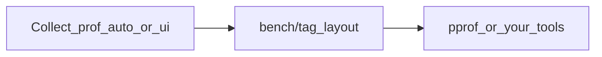

# Prof

Prof is a command-line tool for Go that runs benchmarks with `go test`, captures CPU, memory, mutex, and block profiles, and stores everything under a predictable `bench/<tag>/` tree for analysis with `pprof` and your own tooling.

Use it when you want comparable profiles across experiments and a stable on-disk layout without memorizing `go test` and `pprof` flags.

## What you can do

| Goal | Start here |
| ---- | ---------- |
| Install the `prof` binary | [Install Prof](install.md) |
| First collect in a few minutes | [Quickstart](quickstart.md) |
| Understand cwd, `go.mod`, and `bench/` | [Working directory and paths](workspace.md) |
| Script or CI: collect without menus | [Collect profiling data](collect.md) |
| Per-function extracts in JSON | [Configure collection](configure.md) |
| Menus: full UI or terminal flows | [Interactive UI and TUI](tui.md) |
| Flags, defaults, and formats in one place | [CLI reference](cli-reference.md) |
| Something failed (TTY, paths) | [Troubleshooting](troubleshooting.md) |

## How the workflow fits together

You label each run with a tag. Prof writes `bench/<tag>/` with binary profiles, text summaries, and optional per-function extracts.

## Terminology

| Term | Meaning |
| ---- | ------- |
| Module root | Directory containing your `go.mod`; run Prof from here, same as for `go test`. |
| Tag | Label for one run; artifacts live in `bench/<tag>/`. |
| Profile type | One of `cpu`, `memory`, `mutex`, `block`. |

## Source

[Prof on GitHub](https://github.com/AlexsanderHamir/prof).

## Next steps

- New to Prof: [Install Prof](install.md), then [Quickstart](quickstart.md).
- Automating: [Collect profiling data](collect.md) and [CLI reference](cli-reference.md).
