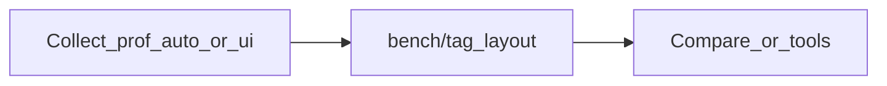

# Prof

Prof is a command-line tool for Go that runs benchmarks with `go test`, captures CPU, memory, mutex, and block profiles, stores everything under a predictable `bench/<tag>/` tree, and compares two tags so you can see *where* performance changed, not only the `benchstat` headline.

Use it when you already trust `ns/op` but need comparable profiles across experiments, a stable layout for `pprof`, and optional CI regression gates on flat-time change.

## What you can do

| Goal | Start here |
| ---- | ---------- |
| Install the `prof` binary | [Install Prof](install.md) |
| First collect and compare in a few minutes | [Quickstart](quickstart.md) |
| Understand cwd, `go.mod`, and `bench/` | [Working directory and paths](workspace.md) |
| Script or CI: collect without menus | [Collect profiling data](collect.md) |
| Diff two runs (tags or file paths) | [Compare runs](compare.md) |
| Per-function extracts and CI rules in JSON | [Configure collection](configure.md) |
| Menus: full UI or terminal flows | [Interactive UI and TUI](tui.md) |
| Fail builds on regressions | [CI and regressions](ci.md) |
| `benchstat` or QCacheGrind on saved data | [Optional tools](tools.md) |
| Flags, defaults, and formats in one place | [CLI reference](cli-reference.md) |
| Something failed (TTY, paths, tools) | [Troubleshooting](troubleshooting.md) |

## How the workflow fits together

You label each run with a tag. Prof writes `bench/<tag>/`. [Compare runs](compare.md) pairs two tags (baseline vs current) for the same benchmark and profile type, or you can point [Optional tools](tools.md) at those directories.

## Terminology

| Term | Meaning |
| ---- | ------- |
| Module root | Directory containing your `go.mod`; run Prof from here, same as for `go test`. |
| Tag | Label for one run; artifacts live in `bench/<tag>/`. |
| Baseline / current | The two tags (or two file paths) you compare. |
| Profile type | One of `cpu`, `memory`, `mutex`, `block`. |

## Source

[Prof on GitHub](https://github.com/AlexsanderHamir/prof). Full CI JSON schema and GitHub Actions examples: [CI/CD configuration](https://github.com/AlexsanderHamir/prof/blob/main/docs/cicd_configuration.md).

## Next steps

- New to Prof: [Install Prof](install.md), then [Quickstart](quickstart.md).
- Automating: [Collect profiling data](collect.md) and [CLI reference](cli-reference.md).
