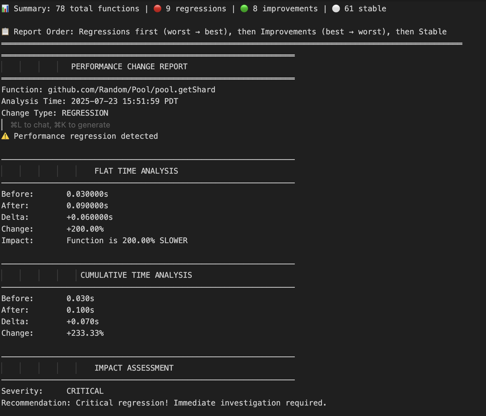

# Prof - Go Benchmark Profiling Made Simple

Prof automates Go performance profiling by collecting all pprof data in one command and enabling easy performance comparisons between benchmark runs.

[](https://godoc.org/github.com/AlexsanderHamir/prof)
[](https://goreportcard.com/report/github.com/AlexsanderHamir/prof)
[](https://opensource.org/licenses/MIT)


▶️ [Watch Demo Video](https://cdn.jsdelivr.net/gh/AlexsanderHamir/assets@main/output.mp4)

## Benchmark Comparison Summary View:

This view highlights regressions, improvements, and stable functions.


## Benchmark Comparison Detailed View:

This view provides a breakdown of performance metrics per function.



## Why Prof?

**Before Prof:** Profiling a single benchmark with multiple profile types requires dozens of manual commands:

```bash
# Run benchmark
go test -bench=BenchmarkName -cpuprofile=cpu.out -memprofile=memory.out ...

# Generate reports for each profile type
go tool pprof -cum -top cpu.out
go tool pprof -cum -top memory.out

# Extract function-level data for each function of interest
go tool pprof -list=Function1 cpu.out > function1.txt
go tool pprof -list=Function2 cpu.out > function2.txt
# ... repeat for every function × every profile type
```

**With Prof:** One command collects everything and organizes it automatically.

## Installation

```bash
go install github.com/AlexsanderHamir/prof/cmd/prof@latest
```

## Quick Start

1. **Collect profiling data:**

```bash
prof --benchmarks "[BenchmarkMyFunction]" --profiles "[cpu,memory]" --count 5 --tag "v1.0"
```

2. **Compare performance between tags:**

```bash
prof track --base-tag "TagNamev1.0" --current-tag "TagNamev1.1" --bench-name "BenchmarkFunctionName" --profile-type "cpu" --output-format "summary"
```

## Usage

### Data Collection

```bash
prof --benchmarks "[BenchmarkFunc1,BenchmarkFunc2]" \
     --profiles "[cpu,memory,mutex,block]" \
     --count 10 \
     --tag "experiment-1"
```

**Options:**

- `--benchmarks`: Benchmark functions to run (comma-separated in brackets)
- `--profiles`: Profile types: `cpu`, `memory`, `mutex`, `block`
- `--count`: Number of benchmark iterations
- `--tag`: Identifier for this run

### Performance Comparison

```bash
prof track --base-tag "baseline" \
           --current-tag "experiment" \
           --bench-name "BenchmarkMyFunction" \
           --profile-type "cpu" \
           --output-format "summary"
```

**Options:**

- `--base-tag`/`--current-tag`: Tags to compare
- `--bench-name`: Exact benchmark function name
- `--profile-type`: `cpu`, `memory`, `mutex`, or `block`
- `--output-format`: `"summary"` (quick overview) or `"detailed"` (comprehensive reports)

## Configuration (Optional)

By default, Prof collects function-level profiling data for **every function** it finds in your profiles. This can generate hundreds of files for large codebases. Use configuration to focus on specific functions.

### Setting Up Configuration

```bash
prof setup
```

This creates a `config_template.json` file in your current directory.

### Configuration Options

```json
{
  "function_collection_filter": {
    "BenchmarkMyPool": {
      "include_prefixes": [
        "github.com/myorg/myproject",
        "github.com/myorg/myproject/internal"
      ],
      "ignore_functions": ["init", "TestMain", "setupBenchmark"]
    },
    "BenchmarkCache": {
      "include_prefixes": ["github.com/myorg/cache"]
    }
  }
}
```

**Per-benchmark filtering:**

- `include_prefixes`: Only collect detailed data for functions starting with these prefixes (typically your package paths)
- `ignore_functions`: Skip these specific function names, even if they match the prefixes

## What Prof Collects

Prof organizes all data automatically:

```
bench/your-tag/
├── bin/                    # Binary profile files (.out files)
├── text/                   # Benchmark output and pprof text reports
├── cpu_functions/          # Function-level CPU profiling data
├── memory_functions/       # Function-level memory profiling data
└── [profile]_functions/    # Other profile types
```

## Requirements

- Go 1.24.3 or later
- Run from within your Go project directory (where benchmarks are located)

## Examples

**Single benchmark:**

```bash
prof --benchmarks "[BenchmarkStringProcessor]" --profiles "[cpu,memory]" --count 5 --tag "baseline"
```

**Multiple benchmarks:**

```bash
prof --benchmarks "[BenchmarkPool,BenchmarkCache]" --profiles "[cpu,memory,mutex]" --count 10 --tag "v2.0"
```

"
**Performance tracking:**

```bash
prof track --base-tag "baseline" --current-tag "v2.0" --bench-name "BenchmarkPool" --profile-type "cpu" --output-format "summary"
```

## Troubleshooting

**"go: cannot find main module"**

- Run prof from within a Go project directory with `go.mod`

**"Profile file not found"**

- Verify benchmark names are correct
- Ensure benchmarks run successfully and generate profiles

**Too many function files**

- Use configuration to filter functions with `include_prefixes`

**Empty profiles**

- Increase `--count` for more benchmark iterations
- Ensure benchmark does enough work to generate meaningful data

**Configuration Not Taking Effect**

- Make sure the config file is located in the current working directory, the one you're running the command from.

## Contributing

We welcome contributions of all kinds—bug fixes, new features, tests, and documentation improvements. Before getting started, make sure to review the [issues](https://github.com/AlexsanderHamir/prof/issues) to avoid duplicated effort.

### Quick Start

**Requirements:** Go 1.24.3+, Git

```bash
# Clone the repository
git clone https://github.com/AlexsanderHamir/prof.git
cd prof

# Run tests
go test -v ./...

# Check for linter issues (first-time install if needed)
go install github.com/golangci/golangci-lint/cmd/golangci-lint@latest
golangci-lint run

# Build the binary for local testing
go build -o prof ./cmd/prof
```

### Instructions

1. **Run Tests and Linters Locally:**
   GitHub Actions will automatically run unit tests and lint checks on each pull request, but you should run them locally first to ensure your code is clean and passes all checks:

   - Run all tests: `go test ./...`
   - Run the linter: `golangci-lint run`

2. **Follow the Code Style:**
   Use idiomatic Go. Keep functions small, testable, and documented. Use descriptive names and avoid unnecessary abstractions.

3. **Keep Commits Atomic and Meaningful:**
   Structure commits logically, each should represent a focused change. Avoid mixing formatting, refactoring, and feature implementation in a single commit.

4. **Add Tests for New Features or Fixes:**
   All non-trivial changes should be accompanied by appropriate test coverage. If you’re unsure how to test something, feel free to ask in the PR or open an issue first.

5. **Document Any User-Facing Changes:**
   If your contribution affects the CLI, config file, or output format, update the relevant parts of the documentation (README, CLI help, or usage examples).

6. **Open a Pull Request:**
   Once your changes are ready and tested locally, open a PR with a clear description of what’s changed and why. Link to any relevant issues.

7. **Be Open to Feedback:**
   Reviews are meant to maintain code quality and project direction. We’re happy to help iterate on PRs to get them merged.

## License

This project is licensed under the MIT License - see the [LICENSE](LICENSE) file for details.
