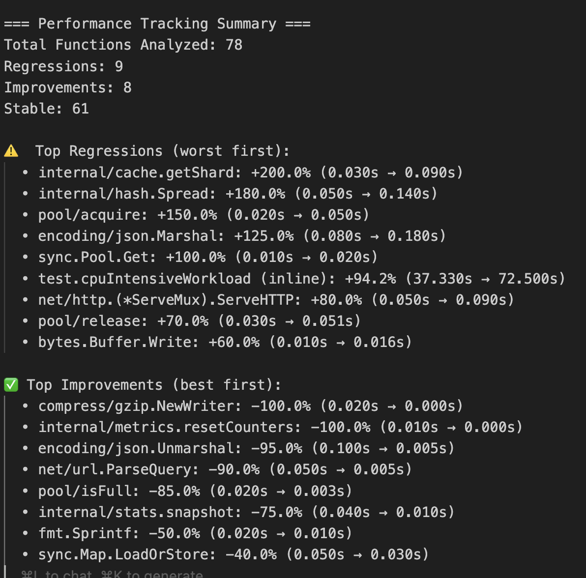

# Prof - Go Benchmark Profiling Made Simple

Prof automates Go performance profiling by collecting all pprof data in one command and enabling easy performance comparisons between benchmark runs.

## Why Prof?

**Before Prof:** Profiling a single benchmark with multiple profile types requires dozens of manual commands:

```bash
# Run benchmark
go test -bench=BenchmarkName -cpuprofile=cpu.out -memprofile=memory.out ...

# Generate reports for each profile type
go tool pprof -cum -top cpu.out
go tool pprof -cum -top memory.out

# Extract function-level data for each function of interest
go tool pprof -list=Function1 cpu.out > function1.txt
go tool pprof -list=Function2 cpu.out > function2.txt
# ... repeat for every function × every profile type
```

**With Prof:** One command collects everything and organizes it automatically.

## Installation

```bash
go install github.com/AlexsanderHamir/prof/cmd/prof@latest
```

## Quick Start

1. **Collect profiling data:**

```bash
prof --benchmarks "[BenchmarkMyFunction]" --profiles "[cpu,memory]" --count 5 --tag "tagName"
```

2. **Compare performance between tags:**

```bash
prof track --base-tag "tagName1" --current-tag "tagName2" --bench "BenchmarkMyFunction" --profile-type "cpu"
```

## Usage

### Data Collection

```bash
prof --benchmarks "[BenchmarkFunc1,BenchmarkFunc2]" \
     --profiles "[cpu,memory,mutex,block]" \
     --count 10 \
     --tag "experiment-1"
```

**Options:**

- `--benchmarks`: Benchmark functions to run (comma-separated in brackets)
- `--profiles`: Profile types: `cpu`, `memory`, `mutex`, `block`
- `--count`: Number of benchmark iterations
- `--tag`: Identifier for this run

### Performance Comparison

```bash
prof track --base-tag "baselineTag" \
           --current-tag "experimentTag" \
           --bench "BenchmarkFunctionName" \
           --profile-type "cpu" \
           --format "summary"
```

**Options:**

- `--base-tag`/`--current-tag`: Tags to compare
- `--bench`: Exact benchmark function name
- `--profile-type`: `cpu`, `memory`, `mutex`, or `block`
- `--format`: `summary` (quick overview) or `detailed` (comprehensive reports)



## What Prof Collects

Prof organizes all data automatically:

```
bench/your-tag/
├── bin/                    # Binary profile files (.out files)
├── text/                   # Benchmark output and pprof text reports
├── cpu_functions/          # Function-level CPU profiling data
├── memory_functions/       # Function-level memory profiling data
└── [profile]_functions/    # Other profile types
```

Each directory contains:

- Raw benchmark output
- Top functions reports (`go tool pprof -top`)
- Function-level performance data (`go tool pprof -list=FunctionName`)
- Profile visualizations (PNG graphs)

## Configuration (Optional)

Control which functions to collect detailed data for:

```bash
prof setup --create-template
```

Example config:

```json
{
  "function_collection_filter": {
    "BenchmarkMyPool": {
      "include_prefixes": ["github.com/myorg/myproject"],
      "ignore_functions": ["init", "TestMain"]
    }
  }
}
```

Without configuration, Prof collects data for all functions (can generate many files).

## Requirements

- Go 1.24.3 or later
- Run from within your Go project directory (where benchmarks are located)

## Examples

**Single benchmark:**

```bash
prof --benchmarks "[BenchmarkStringProcessor]" --profiles "[cpu,memory]" --count 5 --tag "baseline"
```

**Multiple benchmarks:**

```bash
prof --benchmarks "[BenchmarkPool,BenchmarkCache]" --profiles "[cpu,memory,mutex]" --count 10 --tag "v2.0"
```

**Performance tracking:**

```bash
prof track --base-tag "baseline" --current-tag "v2.0" --bench "BenchmarkPool" --profile-type "cpu" --format "summary"
```

## Troubleshooting

**"go: cannot find main module"**

- Run prof from within a Go project directory with `go.mod`

**"Profile file not found"**

- Verify benchmark names are correct
- Ensure benchmarks run successfully and generate profiles

**Too many function files**

- Use configuration to filter functions with `include_prefixes`

**Empty profiles**

- Increase `--count` for more benchmark iterations
- Ensure benchmark does enough work to generate meaningful data

## Contributing

Requirements: Go 1.24.3+, Git

```bash
git clone https://github.com/AlexsanderHamir/prof.git
cd prof
go test -v ./...

# Build for local testing
go build -o prof ./cmd/prof
```
