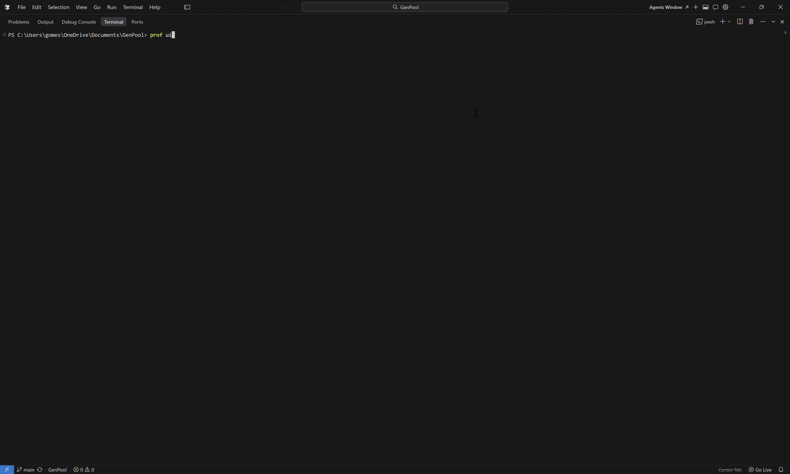

<p align="center">
  
</p>

# Prof

Profiling eats time. Learning tools, running commands, hunting down output. Prof automates the whole process: one command collects everything and organizes it for analysis.

[](https://godoc.org/github.com/AlexsanderHamir/prof)
[](https://goreportcard.com/badge/github.com/AlexsanderHamir/prof)
[](https://opensource.org/licenses/MIT)
[](https://github.com/AlexsanderHamir/prof/releases)


[Documentation Site](https://alexsanderhamir.github.io/prof/)

## Start here

From your module root (`go.mod`):

```bash
prof ui
```

<p align="center">
  
</p>

## Install

```bash
go install github.com/AlexsanderHamir/prof/cmd/prof@latest
```

## Repo links

- [Contributing](CONTRIBUTING.md) · [Codebase design](CODEBASE_DESIGN.md) · [Code of conduct](CODE_OF_CONDUCT.md)

## Requirements

Go 1.24.3+, optional [Graphviz](https://graphviz.org/) for PNG call graphs, `go.mod` at project root.

## Cursor LLM engine (library)

Package [`engine/cursoragent`](https://pkg.go.dev/github.com/AlexsanderHamir/prof/engine/cursoragent) runs the **Cursor CLI** binary **`cursor-agent`** in non-interactive mode (`--print --output-format stream-json`) so higher-level features can send a prompt and read structured results. Nothing in the `prof` **CLI** calls it yet; import it from your own Go code or wait for future commands (for example `prof analyze`).

- Default: resolve **`cursor-agent`** from your **`PATH`**.
- Override: set environment variable **`PROF_CURSOR_AGENT`** to the full path of the agent executable, or pass **`Options.BinaryPath`** when constructing a client (future CLI flags may map to this field; flag wins over env when both are wired).

The subprocess primitive with stdin and streamed stdout lives in [`engine/tooling`](https://pkg.go.dev/github.com/AlexsanderHamir/prof/engine/tooling) as [`RunWithStdinStreamStdout`](engine/tooling/exec_runner.go).

## License

[MIT](LICENSE)
